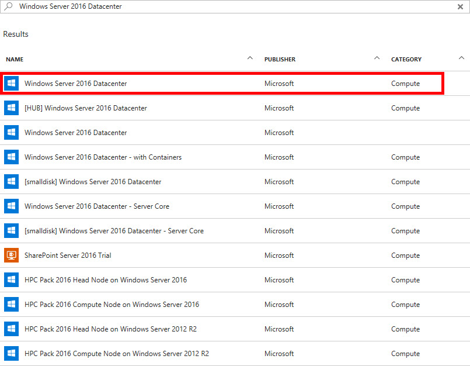
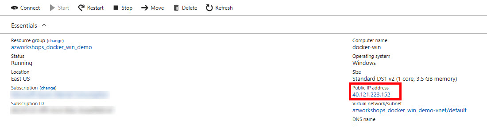

## Objective
All of our work in this workshop, with the exception of the small Azure configuration at the end, will be performed on a single virtual machine. Let's get started creating that VM.

## Create a Resource Group
In order to create resources, we need a _Resource Group_ to place them in.

1. If you are not there already, go ahead and click on the **Resource Groups**  in the Azure Portal to open the Resource Groups blade.

  2. At the top of the Resource Groups blade, click on **Add** . This will open a panel that asks for some basic configuration settings.

  3. Complete the configuration settings with the following:

      * Resource group name: **azworkshops_dockerfile_win_demo**
      * Subscription: **_&lt;choose your subscription&gt;_**
      * Resource group location: **_&lt;choose your location&gt;_**

  4. _&lt;Optional&gt;_ Check _Pin to dashboard_ at the bottom of the panel.

  5. Click **Create**.

  6. It should only take a second for the resource group to be created.  Once you click create, the configuration panel closes and returns you to the list of available resource groups.  Your recently created group may not be visible in the list.  Clicking on **Refresh**  at the top of the Resource Groups blade should display your new resource group.

**NOTE:** When you create a resource group, you are prompted to choose a location. Additionally, as you create individual resources, you will also be prompted to choose locations. The location of resource groups and their resources can be different.  This is because resource groups store _metadata_ describing their contained resources; and, due to some types of compliance that your company may adhere to, you may need to store that metadata in a different location than the resources themselves.  For example, if you are a US-based company, you may choose to keep the metadata state-side while creating resources in foreign regions to reduce latency for the end-user.

## Create a Virtual Machine
Now that we have an available resource group, let's create the actual Windows server.

  1. If you are not there already, go ahead and navigate to the **azworkshops_dockerfile_win_demo** resource group.

  2. At the top of the blade for our group, click on **Add** . This will display the blade for the _Azure Marketplace_ allowing you to deploy a number of different solutions.

  3. We are interested in deploying a Windows Server 2016 Datacenter server. Therefore, in the _Search Everything_ box, type in **Windows Server 2016**.  This will display a couple of different versions.  Choose **Windows Server 2016 Datacenter**.
  

  4. There will be a number of solutions available, including one with containers already enabled.  For the practice, we'll enable containers manually.  Therefore, choose the image as highlighted in the image below.
  

  5. This will display a blade providing more information about the server we have chosen. To continue creating the server, choose **Create**.

  6. We are now prompted with some configuration options.  There are 3 sections we need to complete and the last section is a summary of our chosen options.

     1. Basics

        * Name: **docker-win**
        * VM disk type: **SSD**
        * Username: **localadmin**
        * Password: **Pass@word1234**
        * Confirm password: _&lt;same as above&gt;_
        * Subscription: _&lt;choose your subscription&gt;_
        * Resource group: **Use existing** - **azworkshops_dockerfile_win_demo**
        * Location: _&lt;choose a location&gt;_
        * Already have a Windows Server license? **No**

     2. Size

        * **DS1_V2**

     3. Settings

        * Use managed disks: **No**
        * Storage account: (click on it & **Create New**)
            
            * Name: **dfwindata**_&lt;random number&gt;_  (ex.  _dfwindata123456_)  
              (NOTE: This name must be _globally_ unique, so it cannot already be used.)
            * Performance: **Premium**
            * Replication: **Locally-redundant storage (LRS)**
        * Virtual network: _&lt;accept default&gt;_ (e.g. _(new) azworkshops_dockerfile_win_demo-vnet_)
        * Subnet: _&lt;accept default&gt;_ (e.g. _default (172.16.1.0/24)_)
        * Public IP address: _&lt;accept default&gt;_ (e.g. _(new) docker-win-ip_)
        * Network security group (firewall): _&lt;accept default&gt;_ (e.g. _(new) docker-win-nsg_)
        * Extensions: **No extensions**
        * Availability set: **None**
        * Boot diagnostics: **Enabled**
        * Guest OS diagnostics: **Disabled**
        * Diagnostics storage account: (click on it & **Create New**)

            * Name: **dfwindiags**_&lt;random number&gt;_  (ex.  _dfwindiags123456_)  
            * Performance: **Standard**
            * Replication: **Locally-redundant storage (LRS)**

     4. Summary (just click **OK** to continue)

Once scheduled, it may take a minute or two for the machine to be created by Azure.  Once it has been created, Azure _should_ open the machine's status blade automatically.

## Connect to the Virtual Machine
Once your machine has been created, we can remotely connect to it via a remote desktop protocol (RDP) client.

#### Get Public IP
  1. If it is not already open, navigate to the **Overview** blade of your newly created virtual machine.

  2. In the top section of the blade, in the right column, you should see a **Public IP address** listed. 

  3. Copy the IP address.

#### Connect to the Machine via Remote Desktop
To connect to the machine remotely, we need to download the Remote Desktop Protocol (RDP) profile.

  1. Click on the **Overview**  to return to the general information for the **docker-win** virtual machine.

  2. In the **Actions** section, click on **Connect** . This will download the RDP profile to your machine. 

  3. Open the profile and accept any warnings.

  4. For the username, enter **\localadmin** (with the backslash). And, for the password, enter **Pass@word1234**. Click _OK_.

  5. Again, accept any warnings.

Congratulations.  You have successfully created and connected to your remote Windows Server 2016 server in Azure.  You are now ready to install the Docker runtime.