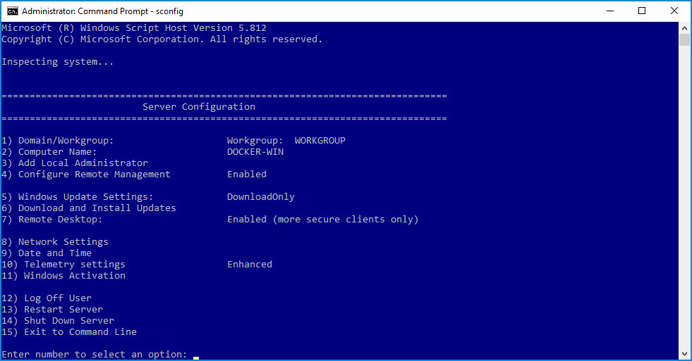

## Overview
We have just created our Windows Server 2016 server.  We now need to apply any available system updates along with installing and configuring Docker to begin working with containers.

## Install Updates
Just like any other operating system, updates are periodically released to support new features and patch any potential security threats.  We will apply the updates first.

  1. If you have not already, connect to your remote Windows Server 2016 server and login.

  2. Open a command prompt as an Administrator, type the following at the command prompt:
  ```shell
  sconfig
  ```
  3. This will open a screen like the following:
  

  4. Choose option `6`, then `A` (twice) to download and install all updates.
 
  5. Depending on the number and size of available updates, this process may take a few minutes and could require a reboot.  Now would be a good time to take a break.

## Install Docker
We now have an updated Windows operating system.  We are ready to install Docker.

  1. Open a PowerShell prompt as an Administrator and type the following:
  ```ps
  Install-PackageProvider -Name NuGet -MinimumVersion 2.8.5.201 -Force
  Install-Module -Name DockerMsftProvider -Force
  Install-Package -Name docker -ProviderName DockerMsftProvider -Force
  Restart-Computer -Force
  ```

  2. This will download the Docker engine and install it as a background service.

  3. After you run the above commands, your virtual machine will reboot forcing a disconnect.  Go ahead and reconnect.

#### Ensure Docker Engine is Running

  1. Open a PowerShell prompt as an Administrator and type the following:
  ```ps
  docker version
  ```

  2. You should see something similar to the following:
  ```ps
  Client:
   Version:      17.03.1-ee-3
   API version:  1.27
   Go version:   go1.7.5
   Git commit:   3fcee33
   Built:        Thu Mar 30 19:31:22 2017
   OS/Arch:      windows/amd64

  Server:
   Version:      17.03.1-ee-3
   API version:  1.27 (minimum version 1.24)
   Go version:   go1.7.5
   Git commit:   3fcee33
   Built:        Thu Mar 30 19:31:22 2017
   OS/Arch:      windows/amd64
   Experimental: false
  ```

  3. Because the service is running, we can now use the `docker` command later in this workshop.


You've successfully installed the Docker engine.