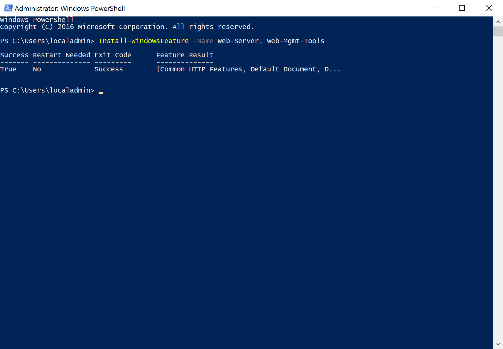
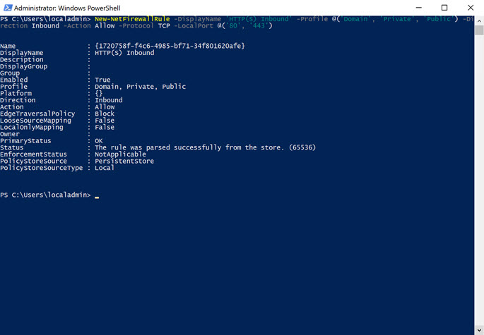

## Overview
The final two elements of preparing our Windows Server virtual machine is to install Internet Information Server (IIS) and configure the necessary port (80) in the firewall to allow HTTP requests.

## Install IIS
Since, for this example, we will be deploying and hosting a basic, static website, the standard IIS components are sufficient.  We could install them through the Server Manager, but we are going to use PowerShell so that we become familiar with executing tasks for later when we need to automate this process in Docker.

  1. Open PowerShell in elevated mode (with Administrator privileges):
     
  2. Type and execute the command `Install-WindowsFeature -Name Web-Server, Web-Mgmt-Tools, NET-Framework-45-ASPNET, Web-App-Dev, Web-Net-Ext45, Web-AppInit, Web-Asp-Net45, Web-ISAPI-Ext, Web-ISAPI-Filter`
  3. You should then see the components download and install.
     
  4. It shouldn't be necessary, but just to be safe, let's reset IIS to pickup the installation of any additional modules. Type the following and press Enter: `iisreset /restart`
  5. We should then see some messages telling us that IIS restarted successfully.

## Configure Firewall
The last step to configuring our server is to allow IIS to serve webpages through port 80.  By default, the port is blocked and so, even if IIS was running, we would not be able to access the site outside of the server, itself.  We, again, are going to use PowerShell to configure the firewall.

  1. If it's not already open, again open PowerShell in elevated mode.
  2. Type the following command `New-NetFirewallRule -DisplayName 'HTTP(S) Inbound' -Profile @('Domain', 'Private', 'Public') -Direction Inbound -Action Allow -Protocol TCP -LocalPort @('80', '443')`
     

We've now completed the server setup. We could configure a separate IIS site and app pool for our site.  But, to keep things simple, we're going to use the default.