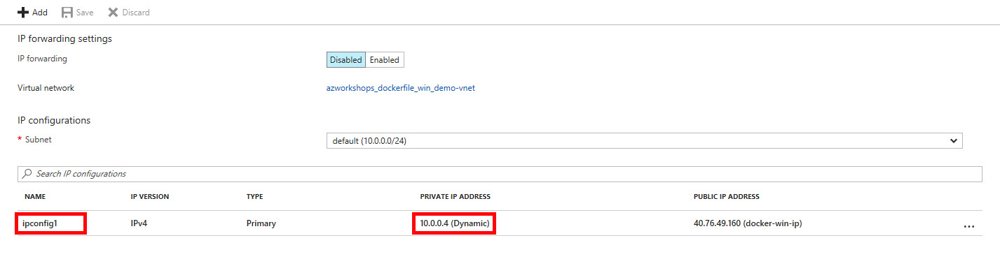
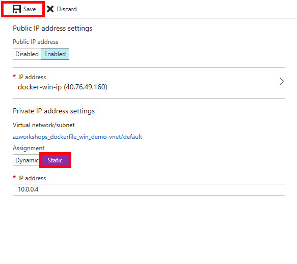
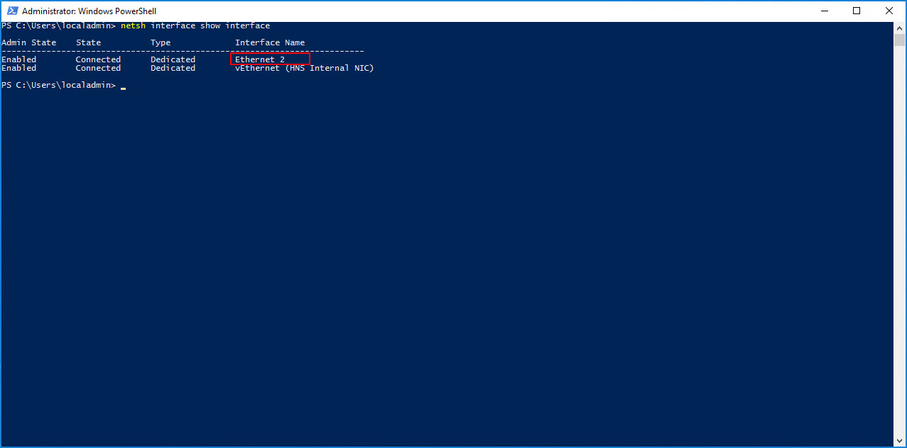
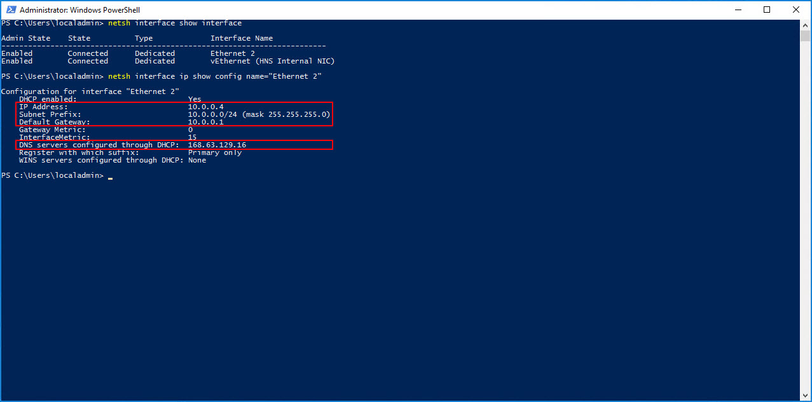
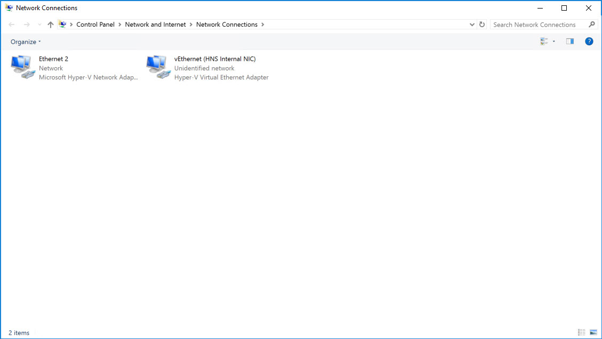
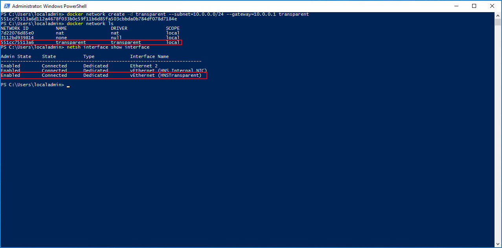
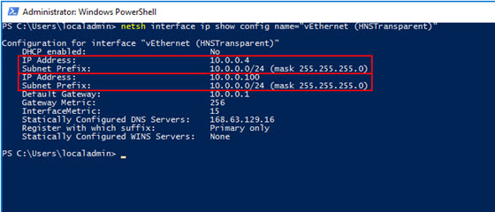

## Overview
The final part of this workshop is to practice exposing a container outside of Azure. We're going to create a simple web server and access it from our local machine. Due to the way Windows (specifically, Hyper-V) currently handles networking with Docker (e.g. the `0.0.0.0` IP assignment to our containers), this process is _much_ simpler in Linux.  So we will step through this slowly so that you understand the steps.

## Network Security Group (NSG)
When we created our Windows Server virtual machine, we accepted the defaults, including the default settings for our NSG.  The default settings only allowed RDP (port 3389) access. We need to add a rule to our NSG to allow HTTP traffic over it's default port for our running web servers.

  1. If you are not still there, go back to the Azure portal and navigate to the settings of your Windows Server virtual machine.

  2. In the left menu, click on **Network interfaces** .

  3. This will open the _Network Interfaces_ blade for your Windows Server virtual machine. Click on the singular, listed interface.

  4. In the left menu, click on **Network security group** .

  5. This will list the currently active NSG.  In our case, it should be the NSG that was created with our virtual machine - **docker-win-nsg**.  Click on the NSG (**NOTE:** Click on the actual NSG link, **NOT** on **Edit**).

  6. In the left menu, click on **Inbound security roles** .

  7. At the top of the blade, click **Add** .

  8. Enter the following configuration:

      * Service: **HTTP**
      * Port range: **80**
      * Priority: **100**
      * Name: **HTTP**

  9. Click **OK**.

This will take a couple of seconds to complete.

## Docker Networking
Full disclosure, the Docker Networking topic is a very deep and complicated subject.  There are many ways to accomplish this, especially, if you are using an orchestrator such as Docker Swarm or Kubernetes.  We typically want a networking configuration that allows us to dynamically add containers (services) and have them auto-discovered.  This is particularly critical for services that should autoscale based on demand.

For our workshop, we are going to sidestep this conversation and leave it to another workshop.  Instead, we are going to create a network schema that will allow us to expose our individual containers _manually_ via an IP address.  In our case, we want a configuration that is similar to what's known as a _Host_ mapping.  By default, Docker on Windows only creates a NAT network.  Therefore, we need to create our Host network manually.  In Docker, this type of network configuration is known as _Transparent_.

For the next section, you will be switching back and forth between the Azure portal and your VM.  Keep both open.

### Set Server Static IP
When we created our VM, we opt'ed that the virtual machine's _internal_ IP was set dynamically.  We now want to set it to a static internal IP; and, we have to do this in two places - Azure portal and the VM, itself.

#### Static IP - Azure
Let's begin by setting the static IP in Azure.

  1. If you are not still there, go back to the Azure portal and navigate to the settings of your Windows Server virtual machine.

  2. In the left menu, click on **Network interfaces** .

  3. This will open the _Network Interfaces_ blade for your Windows Server virtual machine. Click on the singular, listed interface.

  4. In the left menu, click on **IP configurations** .

  5. This will list all of the VM's currently assigned IPs.  At the moment, there should only be one IP configuration listed **ipconfig1**. Under the table heading _PRIVATE IP ADDRESS_, we should see that it is assigned dynamically. Click on **ipconfig1**. 

  6. Approximately 80% down on the resulting blade, you should see a toggle between _Dynamic_ and _Static_. Click on **Static**. 

  7. This should enable the input box for the IP address.  Leave it as-is.

  7. At the top of the blade, click **Save**.

This will take a second, but after the save has been completed, the _Static_ button should turn from purple to light blue and the _Save_ button should be disabled.

#### Static IP - VM
Now, let's set the static IP on the virtual machine.

  1. On the VM, at the PowerShell prommpt (as Administrator), type `netsh interface show interface`.  You will see something like the following table: 
     
     The _vEthernet_ is a virtual adapter added by Docker.  It's the internal, NAT adapter.  We want the _Ethernet_ adapter.  In our case, it's **Ethernet 2**, but it could be 1, 3 or some other number.  It's our primary adapter provided to us by Hyper-V.

  2. Again, at the PowerShell prompt, type `netsh interface ip show config name="Ethernet 2"` (obviously, substitute "Ethernet 2" for the name of your ethernet adapter if it is different). **IMPORTANT:** Keep this information handy as you will need it for a couple of steps below. 
     
     This will show us the necessary configuration (outlined with a red border) to manually configure our adapter settings.
  
  3. At the PowerShell prompt, type `ncpa.cpl`.  This will show something like the following. 

  4. Right-click on your primary ethernet adapter (e.g. "Ethernet 2").  Select **Properties**.

  5. In the dialog window, select **Internet Protocol Version 4 (TCP/IPv4)** and click on **Properties**. 

  6. In this dialog, select **Use the following IP address:** and **Use the following DNS server addresses:**.  Additionally, enter the information you acquired from the previous PowerShell `netsh` command.  Your information may not be exactly like below (again, compare the information to the `netsh` output), but it should like similar. 

  7. Click **OK**.

  8. Click **Close**. (NOTE: You may _temporarily_ lose your connection, but you should automatically be reconnected within a few seconds.)

### Create a Transparent Network
We are now ready to create a _Transparent_, or Host, network within Docker that will allow us to create containers that have IP addresses on the parent virtual machine's subnet.  This will provide a direct route from our inside or outside our network to the container.

Let's start by examining the current networks Docker has created for us.

On the VM, at the PowerShell prompt, type `docker network ls`.  This should return something similar to the following:
```ps
NETWORK ID          NAME                DRIVER              SCOPE
7d22076d85e0        nat                 nat                 local
3112bd939814        none                null                local
```

You will see two networks listed - `nat` and `none`.  Anything attached to the `none` network is not accessible from a network. The `nat` network is what our current three containers are attached to.  It is what allows us to connect to them from the virtual machine's web browser.  The `nat` network is also what allows the containers to communicate with each other.  It's, basically, a network that's _internal_ to that virtual machine.

To view more information and see the containers currently connected to the network, type `docker network inspect nat`.

Among other things, you'll see the subnet, gateway and the containers attached to the network.

In this process, we are going to eventually _reserve_ some IP addresses within our subnet to be used by our containers.  Again, keep in mind, that our containers must reside on the _same subnet_ as our VM.

!! <h4>Multi-Homing</h4> Ideally, you would probably to have two NICs attached to this VM and set it up as a multi-homed server.  This would allow you to have a separate subnet that's dedicated to your containers.  However, this is not the recommended setup for production as you would utilize some type of orchestrator with service discovery and a mesh network.

Let's create our transparent network to sit inside our subnet.

In PowerShell, type `docker network create -d transparent --subnet=10.0.0.0/24 --gateway=10.0.0.1 transparent` and press Enter. **IMPORTANT:** Refer to the information you received from the last `netsh` command.  (NOTE: You may _temporarily_ lose your connection, but you should automatically be reconnected within a few seconds.)

This command tells Docker to create a new network using the _transparent_ driver (`-d`) with a `10.0.0.0/24` subnet and `10.0.0.1` gateway, naming it "transparent".

Now, again, at the PowerShell prompt, type 'docker network ls'.  You should now see the network listed. 

Additionally, type in `netsh interface show interface` to view the available network interfaces (NICs). 

You'll notice that, when we created our transparent network, Docker created a new virtual network interface _vEthernet (HNSTransparent)_. This is the NIC we'll add our IPs to in the steps below.

We've now created our transparent network and we ready to add our publicly accessible containers.

## Add Public Containers
After all of that, we're now finally ready to add our public containers and access them from outside of Azure.

**From this point onward, each step below should be repeated for _each_ container we wish to add.  Simply change the IP address.**

### Pick a "Reserved" IP
Theoretically, our transparent network doesn't exist outside of our VM so Azure DHCP/DNS will not automatically assign an IP address to our container.  We must assign an IP address to it manually. First, let's pick an IP.

I'm going to start with *.*.*.100 as my first container's IP address.  For my network (your's may be different), the full IP address will be `10.0.0.100` with a subnet mask of `255.255.255.0` (again, you get the subnet and mask from the `netsh` command).

### "Reserve" the IP in Azure
So, first, we're not _really_ reserving the IP address.  But, in a way, we kind of are.  We are going to manually assign our IP as a _secondary_ IP to our virtual machine's NIC.

  1. If you are not still there, go back to the Azure portal and navigate to the settings of your Windows Server virtual machine.

  2. In the left menu, click on **Network interfaces** .

  3. This will open the _Network Interfaces_ blade for your Windows Server virtual machine. Click on the singular, listed interface.

  4. In the left menu, click on **IP configurations** .  This time we'll assign a secondary IP address.

  5. In the top menu, click on **Add** .

  6. In the fields make the following selections:

     * Name: **web_public100**
     * Allocation: **Static**
     * IP address: **10.0.0.100** (_use the IP address you chose above_)
     * Public IP address: **Enabled**
     * IP address: (click on it & **Create New**)
         * Name: **web_public100**
         * Assignment: **Dynamic**

  7. Click **OK**.

This will take a second; be patient.  Once it has completed, you'll see the new IP configuration listed in the table.  Make note of the **PUBLIC IP ADDRESS** for the new IP configuration.  You will use this IP address to access your container from a web browser once we're done.

We've added the necessary configuration in Azure to route requests for that IP to our VM. In the next step, we'll add the IP to the machine so that it will _listen_ on that IP address. 

### Assign the IP to the Virtual NIC
Remember the new virtual NIC that was created above when we created our transparent network?  We need to add an IP address to it.  Most of the time you would add the IP address through the GUI, but we cannot do this.  We need to use a feature called "SkipAsSource" [more info](https://blogs.technet.microsoft.com/rmilne/2012/02/08/fine-grained-control-when-registering-multiple-ip-addresses-on-a-network-card/).  Therefore, we must use the `netsh` command once again so that the SkipAsSource feature is not enabled.

Go back to your VM and at the command prompt, type `netsh int ipv4 add address "vEthernet (HNSTransparent)" 10.0.0.100 255.255.255.0` (again, use the virtual NIC name, IP address and subnet mask acquired from the various steps above).

Now, if we type the command `netsh interface ip show config name="vEthernet (HNSTransparent)"`, we see that both IPs (our original static IP and our new IP)have been assigned to our transparent network: 

Our machine will now listen for requests on that IP address.  Our routing is complete. Now, we simply need to add a container and assign it that IP address.

**IMPORTANT:** Our transparent network is a virtual network on our machine.  If we delete our transparent network in Docker, then we also remove the IPs associated with our virtual NIC.  Just be aware.

### Create a Container on Our Transparent Network
We already have our first three containers running on our `nat` network.  Unfortunately, there's no easy way to reconfigure a container's port mapping; and, you can't change it while the container is running.  So, we'll create a new container and attach it to our transparent network.

From the PowerShell command line, type `docker run -d --net=transparent --ip=10.0.0.100 --name "web_public100" test/simpleweb`.

This command does a couple of things.  First, as you may remember from earlier, we are running this container in the background, or as "detached" (`-d`).  Second, we explicitly specify the network in which to attach our container.  In our case `transparent`.  When we use a transparent network (or a few other types), we're required to specify the IP address as, again, the host network's DHCP cannot assign an IP address.  The rest of this command should be familiar.

Let's view our running containers by typing `docker ps`.
```ps
CONTAINER ID        IMAGE               COMMAND                   CREATED             STATUS              PORTS                  NAMES
821e2dc235d4        test/simpleweb      "C:\\ServiceMonitor..."   18 minutes ago      Up 16 minutes       80/tcp                 web_public100
1c84a5399eaa        test/simpleweb      "C:\\ServiceMonitor..."   3 hours ago         Up 3 hours          0.0.0.0:8082->80/tcp   web_8082
3b644253ff84        test/simpleweb      "C:\\ServiceMonitor..."   3 hours ago         Up 3 hours          0.0.0.0:8081->80/tcp   web_8081
82dc9c21c5f2        test/simpleweb      "C:\\ServiceMonitor..."   3 hours ago         Up 3 hours          0.0.0.0:8080->80/tcp   web_8080
```

We now see our `web_public100` running, but there is no NAT translation - it's simply listening on port 80.  If we _inspect_ the container's configuration (e.g. `docker container inspect web_public100`), we see our assigned IP address closer to the end of the output.

Whew! That's it! We've added a Widows container and made it accessible outside of Azure.  Let's test our work.

### Test on the VM
Let's make sure we can access the container from our VM.

  1. On the VM, open up Internet Explorer.

  2. In the URL, type the IP address, including 'http://' (e.g. `http://10.0.0.100`).  NOTE: We don't have to use a port this time as the container is mapped directly to port 80.

If successful, you should see the 'Hello World' web page.

### Test Outside of Azure
Now that we know our container is accessible from a IP address from within our subnet, let's make sure it's accessible from outside of Azure.

  1. On your _local_ machine, open a web browser.

  2. Use the _public IP address_ you acquired from adding the "Reserved IP" to your machine and type it (including the 'http://') into the URL.

Success! Again, your should see the 'Hello World' web page. 

## Review
Gee, that was a bit of work!  As I stated earlier, doing this in Linux is much easier.  If you haven't done so already [try it out](https://azureworkshops.github.io/Dockerfiles-Linux/).  Since this was quite a bit of effort, I wanted to quickly review what we've done.

  1. We opened up port 80 in Azure's firewall to allow HTTP traffic to flow through.

  2. We changed our IP configuration for the VM to a static IP from a dynamic IP so that we could later add additional IPs to the VM's NIC and not mess up routing should the VM reboot.

  3. We created a _transparent_ network in Docker to allow our containers to connect directly to our Host subnet.

  4. We picked a "reserved IP" and then:

     1. Added that IP to our VM in Azure as a new, static IP configuration

     2. Added that IP to our virtual NIC created by the Docker transparent network

     3. Created a new container and assigned it to our transparent network and assigned it the IP

All of the steps on this page, simply comes down to the previous 4-7 steps.  Also, remember, now that the networking is setup (steps 1-3), you only need to follow step 4 for all future containers on this VM that should have external access.

## Next Steps
As stated multiple times, this is not the ideal scenario when you need a fully-scalable and redudant solution.  For those types of environments, it is recommended that you use an orchestrator like Docker Swarm or Kubernetes.

However, with that said, you could run step 4 again and add another web server container to your VM's Docker.  Now that you have two containers on the subnet, you could add a load balancer in Azure for a bit of redudancy.  Of course, it's only as redudant as the VM, itself.  For this, you would probably want to add an Availability Set with multiple VMs hosting Docker.  Then, load balance across the multiple Docker containers.
